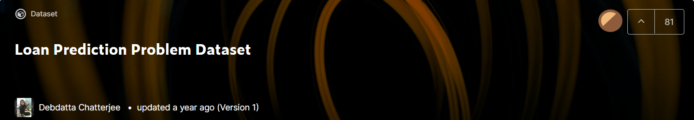
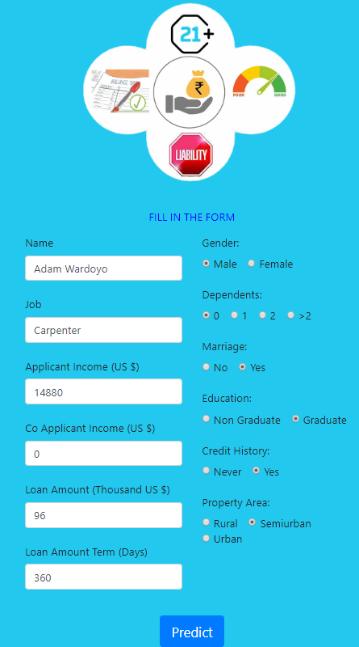
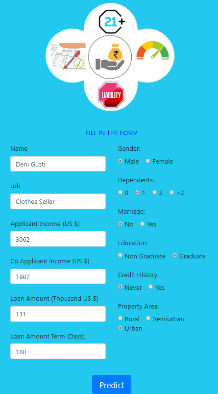
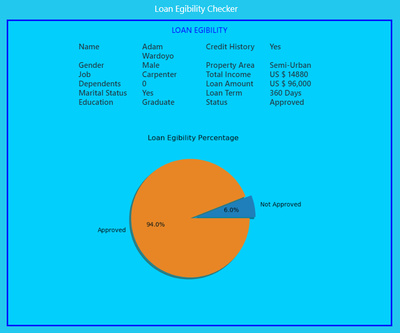
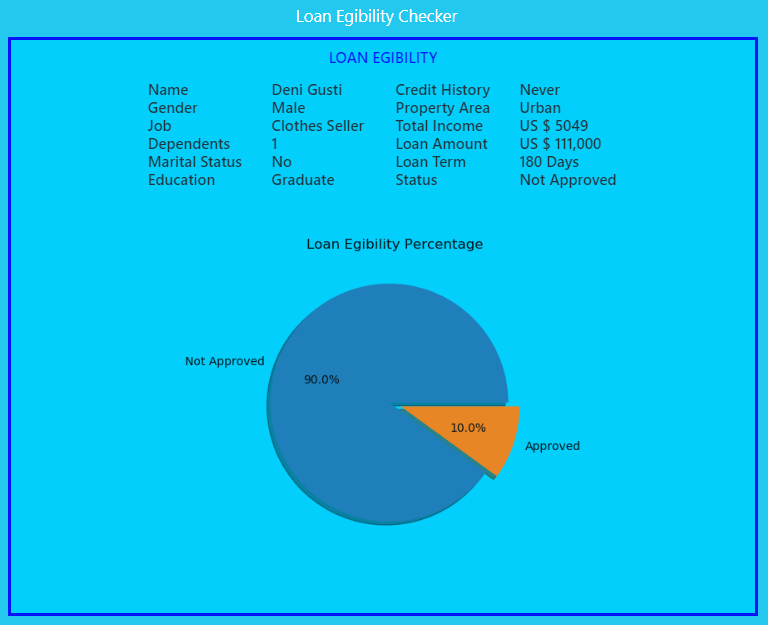

# **CLASSIFICATION: LOAN APPROVAL PREDICTION**

> #### Predict the eligibility of the applicant in terms of loan by using and comparing several classification methods (Logistic Regression, Neighbor KNearest, Gaussian Naive Bayes, Complement Naive Bayes, Random Forest, and Support Vector Machine) and representing product using web-based localhost as an interface.

- **Dataset**: The dataset used in this repository is a dataset from the Kaggle website. 

 
- **Source**: [Kaggle](http://www.kaggle.com/altruistdelhite04/loan-prediction-problem-dataset)

- **Purpose** : Predict the eligibility of the applicant in terms of loan. Loan Prediction system is a system which provides you a interface for loan approval to the applicants application of loan. Applicants provides the system about their personal information and according to their information system gives his status of availability of loan.

- **Machine Learning Algorithms**: Logistic Regression, KNearest Neighbors, Gaussian Naive Bayes,  Complement Naive Bayes, Random Forest, dan Support Vector Machine.

In this repository, those are a Jupyter Notebook and Folder Flask:  
File (app_loan.py): Flask application file with the main server.  
File (loan_predict.ipynb): Notebook files contain data collection work, Exploratory Data Analysis (EDA), and Classification Modeling.

## __Data Explanation__

- __Features__:
    1. __Loan_ID__
        - Unique Number of Applicant Data
    2. __Gender__
        - Male/ Female 
    3. __Married__
        - Applicant Married (Yes/ No)
    4. __Dependents__
        - Number of Dependents (Family or Siblings)
    5. __Education__ 
        - Applicant Education (Graduate/Non Graduate)
    6. __Self_Employed__
        - Self Employed (Yes/ No)
    7. __ApplicantIncome__
        - Applicant Income (US $)
    8. __CoApplicantIncome__
        - Co Applicant Income (US $)
    9. __LoanAmount__ 
        - Loan Amount (Thousand US $)
    10. __LoanAmountTerm__
        - Term of loan in days
    11. __Credit_History__
        - Credit history (Ever/ Never)
    12. __Property_Area__
        - Urban: Large size & High Density of Population > 100K, Heterogeneity, High Mobility.
        - Semiurban: Between Urban & Rural 
        - Rural: Outside Cities or Towns (Villlages or Hamlets), contradicty of Urban

- TARGET (Categorical)
    __Loan_Status__ : __Yes__ or __No__

## **Flask Preview**
The following is a preview of the App created using Flask to display:
> * Home/ Form filling by users
> * Prediction Result 

### **Home**
Initial display (``http://127.0.0.1:3000``) The home page shows the initial interaction with the user/ applicant, they will be notified that the web requires some requesting information.
Only the features described in **File (loan_predict.ipynb)** will be used in predictions.

There is a __"Predict"__ button, to go to the __"Result"__ page. 

- __First Applicant__: 

 

- __Second Apllicant__: 

### **Predict**
Final display (``http://127.0.0.1:3000/predict``). The __"predict"__ page shows the section that displays the information that has been filled in, then has a judgment on the prediction of whether the user / applicant's status is __"Approved"__ or __"Non Approved"__.

It's also displayed the percentage of probabilities for each class, so this information can estimate how much predictions are generated for one class and how likely for other class.

The applicant's risk to the loan company will be seen in the pie graph.

There is also a __"Loan Egibility Checker"__ button, to return to the __"Home"__ page. 

- __First Applicant__: 

 

- __Second Apllicant__: 

 

> **Note**: For further discussion if you have questions, criticisms, and suggestions, feel free to contact my email: kusumardanar@gmail.com. 
 

## __THANK YOU__
